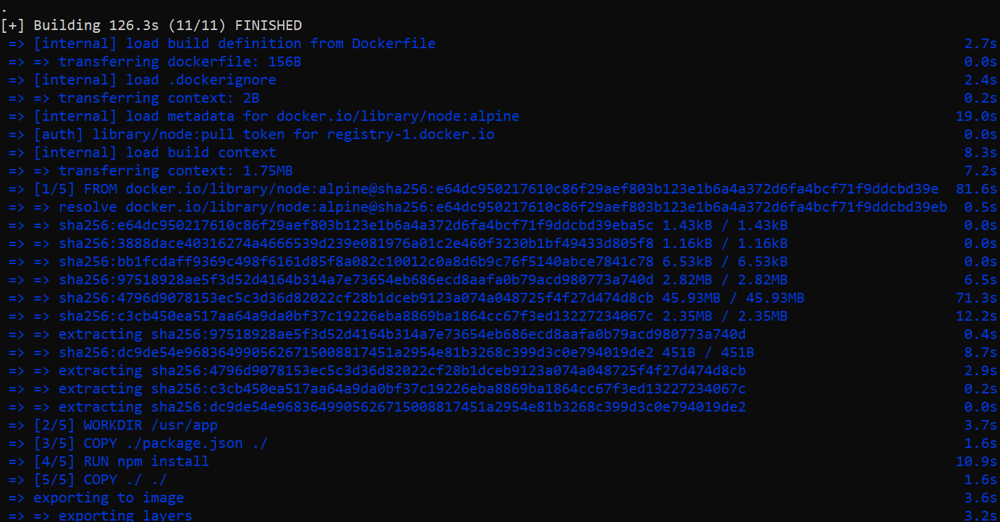

# Simple node app with docker
---

## Table of contents

  - [Overview](#overview)
  - [The Features](#the-features)
  - [Technologies](#Technologies)
  - [Screenshot](#screenshot)
  - [Links](#links)
  - [What I learned](#what-i-learned)
  - [Useful resources](#useful-resources)
  - [Author](#author)

---

## Overview

This is a simple node application that is made with docker container. docker is implemented for the containerization of this application. In the Dockerfile all the necessary command is used for building the image. finally the image was build successfully on my local machine.

### The Features
- get knowledge about container
- docker image
- Dockerfile

### Technologies

- nodejs
- express
- docker

### Screenshot
---

### Links

- github Link : [git Link](https://github.com/Rakibul-Islam-GitHub/docker-kubernetes)

### What I learned
The main objective of this project was to get hands-on experience by working with `docker`.  I have gained a lot of knowledge by handling `Dockerfile` & creating a very simple applications with `nodeJs` & `ExpressJs`. I have build the image and also run the container successfully on my machine.

### Useful resources

[docker - Doc](https://docs.docker.com/) 
[ExpressJs - Doc](https://expressjs.com/) 

---

## Author

- Linkedin - [Rakibul](https://linkedin.com/in/rakibul21)
